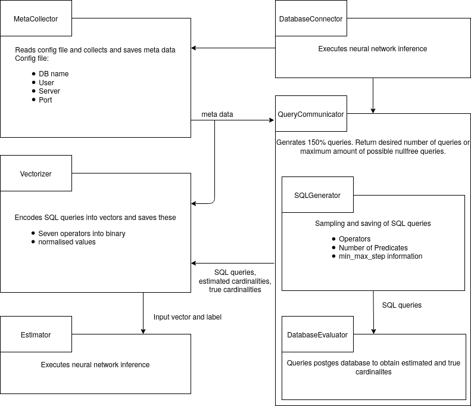

# Local Cardinality Estimation (See [1])

## The complete documentation can be found [here](https://lucaswo.github.io/local-cardinality-estimation/).
- The submodule 'meta-collector' collects the several informations from the requested table and saves the information into a .json file

- The submodule 'sql-generator' uses the output of the meta-collector to create random SQL-Queries with the corresponding schema

- The submodule 'vectorizer' uses the output of the sql-generator to encode it into a vectors 

- The submodule 'estimator' takes the encoded vectors and uses them on a neural network

- The submodule 'postrgres-evaluator' takes the sql-queries and executes them on the postgres-database to get the true cardinality




For building the Documentation you need to execute the `setup_doc.sh`. This script installs the prerequisites if not already installed, builds the documentation and starts the documentation-server.

## References

[1] [Woltmann et al., Cardinality estimation with local deep learning models, aiDM 2019](https://dl.acm.org/citation.cfm?id=3329875)

## Cite

Please cite our paper if you use this code in your own work:
```
@article{woltmann2019localdeep,
  title = {Cardinality estimation with local deep learning models},
  author = {Woltmann, Lucas and Hartmann, Claudio and Thiele, Maik and Habich, Dirk and Lehner, Wolfgang},
  booktitle = {Proceedings of the Second International Workshop on Exploiting Artificial Intelligence Techniques for Data Management},
  series = {aiDM '19},
  year = {2019}
}
```
