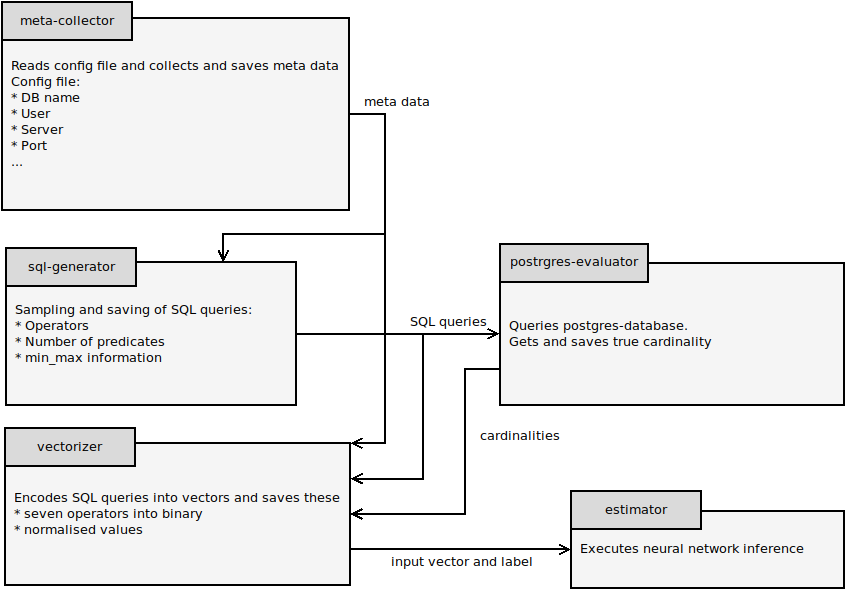

# Local Cardinality Estimation

KP SS2020

- The submodule 'meta-collector' collects the several informations from the requested table and saves the information into a .json file

- The submodule 'sql-generator' uses the output of the meta-collector to create random SQL-Queries with the corresponding schema

- The submodule 'vectorizer' uses the output of the sql-generator to encode it into a vectors 

- The submodule 'estimator' takes the encoded vectors and uses them on a neural network

- The submodule 'postrgres-evaluator' takes the sql-queries and executes them on the postgres-database to get the true cardinality

For building the Documentation you need to execute the `setup_doc.sh`. This script installs the prerequisites if not already installed, builds the documentation and starts the documentation-server.